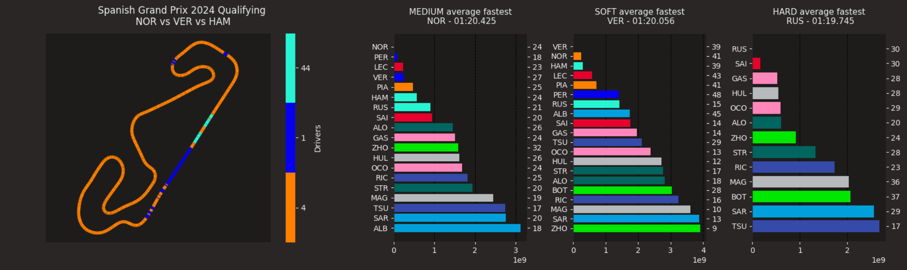
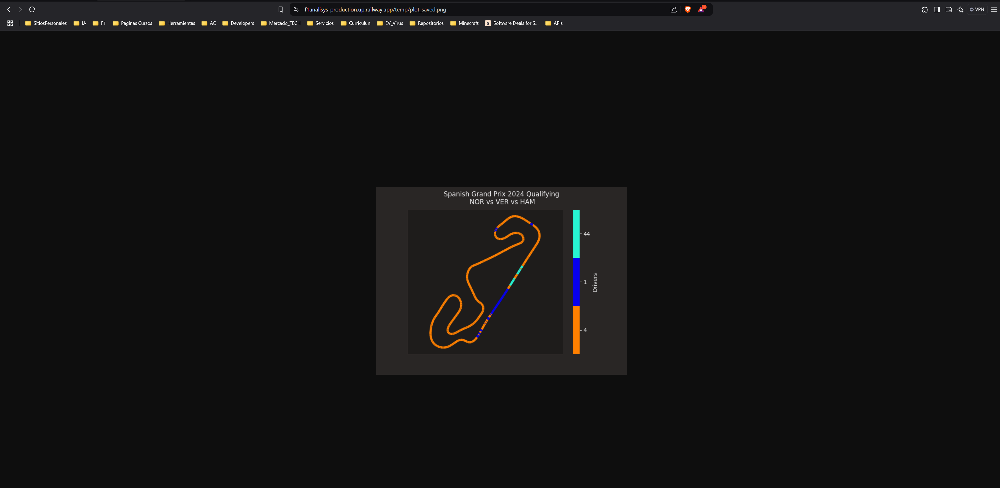
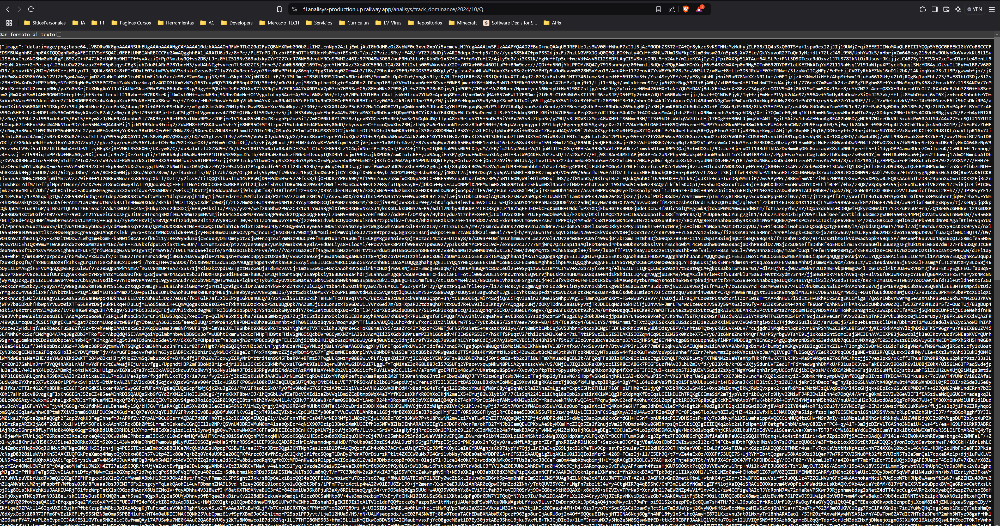

# F1Analisys

  



F1 project to analyze the data of the F1 championship making use of the pandas library to handle the data and the matplotlib library to plot different analisys like:

- Track dominance  
- Top speed  
- Lap time average  
- Race pace 
- Team performance  
- Fastest laps  
- Race position evolution 
- Fatest drivers each compound  

# Sections
1. [Instalation](#instalation)
2. [Run](#run)
3. [Get analisys](#get-analisys)
4. [Swagger](#swagger)
5. [Contributing](#contributing)


## Instalation

To install the repository, you can make a fork of the repository or cloning my repository using the following command:

```commandline
git clone git@github.com:Maxbleu/F1Analisys.git
```

Later , you can install the required libraries using pip with the following command:

```commandline
pip install -r requirements.txt
```

### Run

To run the project, you need to execute the following command:

```commandline
python -m uvicorn main:app --reload
```


## Get analisys

This project is designed to get every analisys named before for normal persons out of the tech word interested in the technical part of F1 and developers.

In every endpoint of this project, after the url, you can put if you want convert the image to bytes putting 
`?convert_img=True` in the url, because, `?convert_img=False` is enabled by default. 

### In image

#### `/official/track_dominance/2024/10/Q?convert_img=False` or `/official/track_dominance/2024/10/Q`
In this case the url would be: [this example](https://f1analisys-production.up.railway.app/official/track_dominance/2024/10/Q)



### In bytes
#### `/official/track_dominance/2024/10/Q?convert_img=True`
In this case the url would be: [this example](https://f1analisys-production.up.railway.app/official/track_dominance/2024/10/Q?convert_img=True)



## Swagger

To see the endpoints of the project you only need to [this link](https://f1analisys-production.up.railway.app/)

## Contributing

For contributing to this project, you need to read first of all [CONTRIBUTING.md](https://github.com/Maxbleu/F1Analisys/blob/master/CONTRIBUTING.md)

## Special mention

I want to thank to Fastf1 project for the data, and to the F1 community for the passion and the love for the sport.
If that project don't exist, this project wouldn't exist. I only have one word in my mind: THANK YOU.

## Notice

F1Analisys is unofficial and are not associated in any way with the Formula 1 companies. F1, FORMULA ONE, FORMULA 1, FIA FORMULA ONE WORLD CHAMPIONSHIP, GRAND PRIX and related marks are trade marks of Formula One Licensing B.V.
